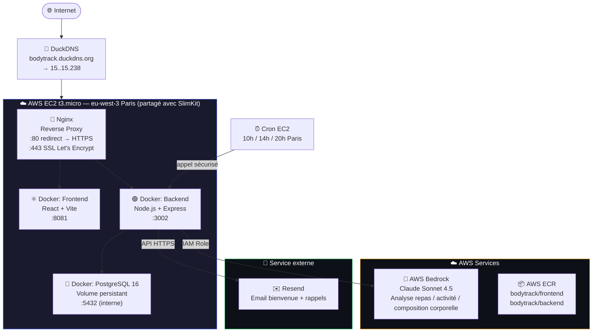
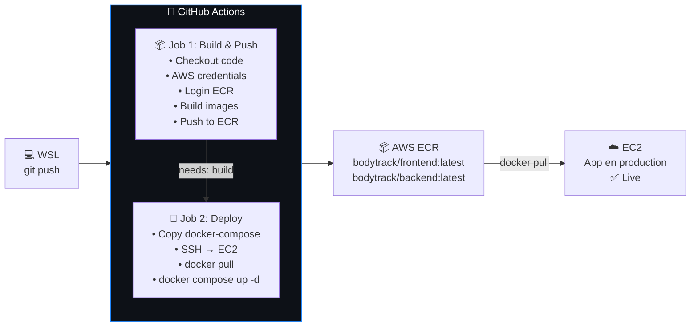
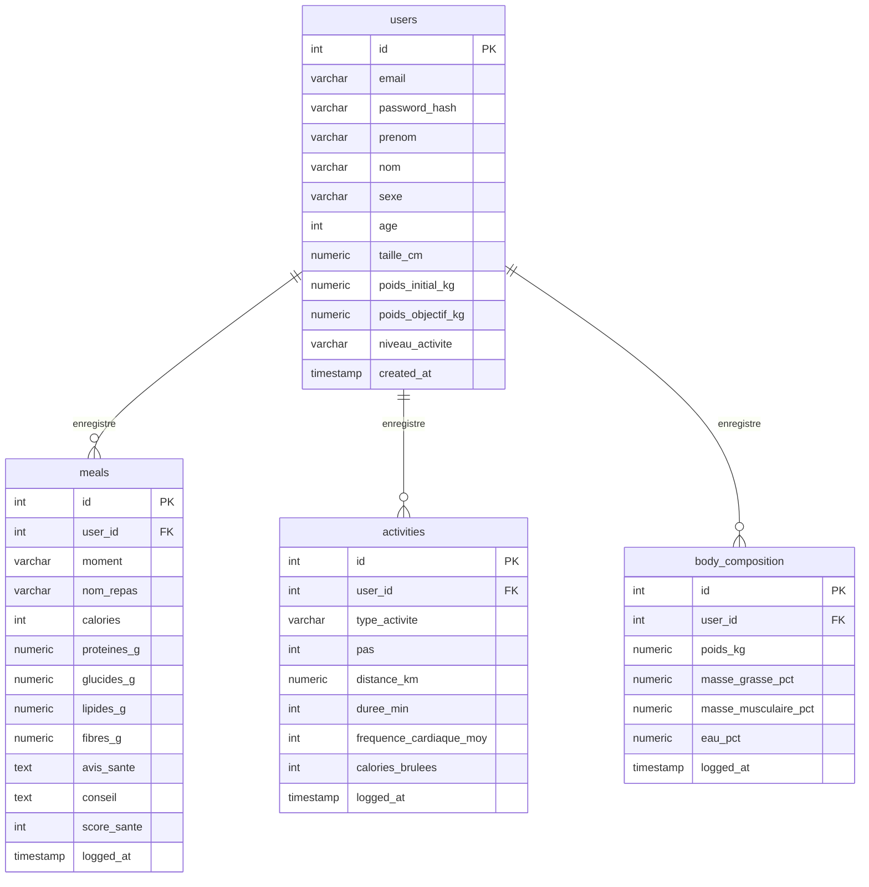
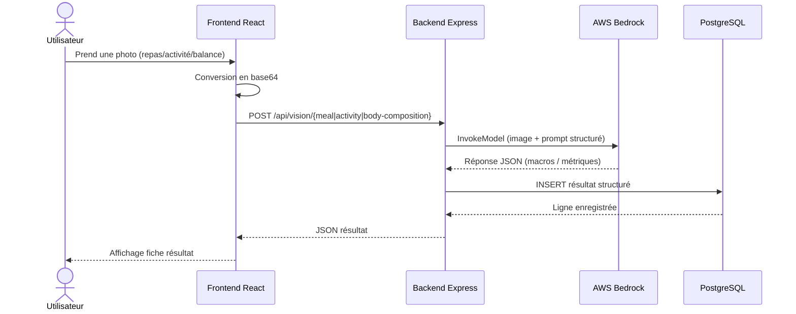

# 🏋️ BodyTrack

[](https://bodytrack.duckdns.org) [](https://aws.amazon.com) [](https://www.postgresql.org) [](https://github.com/features/actions) [](https://www.docker.com)

> **🔒 Live** : <https://bodytrack.duckdns.org>

---

## 🤝 Honnêteté intellectuelle

Ce projet a été réalisé dans un **contexte d'apprentissage personnel**.

L'intégralité du **code applicatif** (frontend React, backend Node.js/Express, schéma PostgreSQL, logique métier) a été **générée par Claude (Anthropic)**.

En revanche, **Frédéric Junior EPESSE PRISO** a :

- Suivi et compris chaque étape du déploiement
- Réutilisé et étendu une infrastructure AWS déjà provisionnée manuellement (EC2, ECR, IAM)
- Créé les nouveaux repos ECR et configuré les secrets GitHub spécifiques à ce projet
- Configuré le pipeline **CI/CD GitHub Actions** pour ce second service
- Géré la **cohabitation de deux applications** sur le même serveur (gestion de ports, sous-domaines distincts)
- Configuré un **second certificat HTTPS** (Let's Encrypt + DuckDNS) pour `bodytrack.duckdns.org`
- Créé un compte **Resend** et configuré l'envoi d'emails transactionnels
- Installé et configuré des **tâches cron** sur le serveur pour les rappels automatiques
- Diagnostiqué et corrigé des bugs réels en production (voir section dédiée plus bas)
- Effectué un **audit de confidentialité** sur le code et fait corriger des données personnelles codées en dur dans les placeholders

Ce projet est un **projet personnel d'apprentissage**, pas un projet professionnel.

---

## 📋 Description

BodyTrack est une application web de suivi de perte de poids et de recomposition corporelle. Le principe central : **aucune saisie manuelle de calories ou de grammes**. Tout passe par l'analyse visuelle d'une photo, via un LLM multimodal.

### Fonctionnalités

- **Authentification complète** : inscription/connexion avec JWT + mots de passe hashés (bcrypt)
- **Journal quotidien** : vue chronologique Matin / Midi / Collation / Soir
- **Analyse de repas par photo** : calories, protéines, glucides, lipides, fibres, score santé sur 10, conseil de coach nutritionnel
- **Analyse d'activité par capture d'écran** : extraction des pas, distance, durée, fréquence cardiaque, calories brûlées depuis une capture Apple Health / Google Fit / montre connectée
- **Analyse de composition corporelle par capture d'écran** : poids, masse grasse %, masse musculaire %, eau %, depuis une capture de balance connectée
- **Calcul métabolique en temps réel** : métabolisme de base (formule de Mifflin-St Jeor), dépense totale selon le niveau d'activité, déficit calorique net du jour
- **Suivi de progression** : historique de poids, estimation du nombre de semaines restantes pour atteindre l'objectif
- **Emails transactionnels** : email de bienvenue à l'inscription + rappels automatiques 3x/jour si un repas n'a pas été loggé
- **Propulsé par Claude Sonnet 4.5** via AWS Bedrock

---

## 🏗️ Architecture

### Infrastructure globale



### Pipeline CI/CD



### Schéma de base de données



### Flux d'analyse par photo (vision IA)



---

## 🛠️ Stack technique

| Composant       | Technologie                                |
| ---------------- | ------------------------------------------- |
| Frontend         | React 18 + Vite                              |
| Backend          | Node.js + Express                            |
| Authentification | JWT + bcrypt                                  |
| Base de données  | PostgreSQL 16 (conteneur Docker, volume persistant) |
| IA               | AWS Bedrock (Claude Sonnet 4.5)              |
| Email            | Resend (API transactionnelle)                |
| Scheduler        | Cron (Ubuntu, sur l'EC2)                     |
| Conteneurs       | Docker + Docker Compose                       |
| Registry         | AWS ECR                                       |
| Serveur          | AWS EC2 t3.micro (Ubuntu 24.04) — partagé avec SlimKit |
| CI/CD            | GitHub Actions                                |
| Reverse Proxy    | Nginx (sous-domaine dédié)                    |
| SSL              | Let's Encrypt (Certbot, challenge DNS manuel) |
| DNS              | DuckDNS                                       |
| Région AWS       | eu-west-3 (Paris)                             |

---

## 📚 Ce que j'ai appris en déployant ce projet

### 1. Cohabitation de plusieurs applications sur un même serveur

- Gestion de **conflits de ports** entre deux apps Docker sur la même instance EC2 (SlimKit utilisait déjà 8080/3001)
- Attribution de ports dédiés (8081/3002) et **isolation des containers** par projet
- Création d'un **second sous-domaine DuckDNS** pointant vers la même IP publique
- Configuration de **deux blocs `server` Nginx distincts**, chacun avec son propre certificat SSL
- Compréhension du rôle du `server_name` dans le routage Nginx multi-sites

### 2. Bases de données relationnelles en production

- Conception d'un schéma PostgreSQL avec **clés étrangères et contraintes `ON DELETE CASCADE`**
- Exécution automatique du schéma SQL au démarrage du backend (idempotence avec `CREATE TABLE IF NOT EXISTS`)
- Diagnostic d'un bug classique : **PostgreSQL retourne les types `NUMERIC` comme des chaînes de caractères** en JavaScript, ce qui peut transformer un calcul en `NaN` silencieux
- Utilisation de `docker exec` pour interroger une base de données directement en production avec `psql`
- Gestion d'un **volume Docker persistant** pour ne pas perdre les données au redémarrage du container

### 3. Authentification et sécurité applicative

- Implémentation d'un système **JWT** complet (signature, vérification, expiration)
- Hashage de mots de passe avec **bcrypt** (jamais de mot de passe en clair en base)
- Création d'un **middleware d'authentification** réutilisable sur toutes les routes protégées
- Compréhension de la différence entre un secret JWT applicatif et un secret de cron interne (deux mécanismes d'authentification différents pour deux usages différents)

### 4. Audit de confidentialité du code

- Découverte qu'un **placeholder de formulaire** (texte d'exemple visible par tout visiteur) contenait mes propres informations personnelles (prénom, nom, âge, poids), codées en dur par erreur dans le code source
- Vérification en **navigation privée sur un navigateur tiers** (Edge InPrivate) pour confirmer que le problème venait du code et non du cache navigateur
- Correction immédiate par remplacement des exemples par des données génériques neutres
- Compréhension qu'un dépôt **GitHub public** expose tout son code source, y compris les détails apparemment anodins comme les placeholders

### 5. Intégration d'un service tiers d'emailing (Resend)

- Création d'un compte et d'une **clé API Resend**
- Découverte concrète de la limitation du **mode sandbox/test** : impossible d'envoyer à une adresse autre que celle du compte, indépendamment du fournisseur (Gmail, Outlook, GMX...)
- Compréhension qu'il faut **vérifier un domaine DNS** pour lever cette restriction et ouvrir l'envoi à des destinataires multiples
- Conception de templates d'emails HTML simples (bienvenue + rappel) directement en JavaScript

### 6. Tâches planifiées (cron) en production

- Écriture d'un **script bash** appelé par cron, avec gestion de logs et de secret partagé
- Installation de **3 tâches cron** distinctes via `crontab -e` non-interactif (`crontab -l | ... | crontab -`)
- Sécurisation d'un endpoint interne avec un **header secret personnalisé** (`x-cron-secret`), différent du système d'auth utilisateur
- Compréhension du **décalage horaire UTC/heure de Paris** et de son impact sur la planification cron (nécessité d'ajuster manuellement les horaires au changement heure d'été/hiver)

### 7. Débogage de bugs réels en production

- **Bug de modèle Bedrock "Legacy"** : un modèle d'IA peut devenir indisponible (`Access denied... marked as Legacy`) sans prévenir, nécessitant de vérifier la liste des modèles actifs via `aws bedrock list-inference-profiles`
- **Bug de nommage de champ** : une fonction de calcul métabolique recevait un objet avec le champ `poids_initial_kg` alors qu'elle attendait `poids_kg`, provoquant un `NaN` silencieux transformé en `null` par `JSON.stringify`
- Méthodologie de debug : **tester l'API directement avec `curl`** (en isolant authentification, payload et réponse) avant de chercher le bug côté frontend
- Lecture de **logs de containers Docker en temps réel** (`docker logs -f`) pour observer le comportement réel du backend pendant les tests utilisateur

---

## 🗂️ Structure du projet

```
bodytrack-app/
├── .github/
│   └── workflows/
│       └── deploy.yml          # Pipeline CI/CD GitHub Actions
├── backend/
│   ├── src/
│   │   ├── server.js           # Point d'entrée Express + init schéma DB
│   │   ├── db/
│   │   │   ├── pool.js         # Pool de connexions PostgreSQL
│   │   │   └── schema.sql      # Schéma complet (4 tables)
│   │   ├── middleware/
│   │   │   └── auth.js         # Middleware JWT
│   │   ├── routes/
│   │   │   ├── auth.js         # Inscription / connexion
│   │   │   ├── profile.js      # Dashboard du jour + progression
│   │   │   ├── vision.js       # 3 endpoints d'analyse IA (repas/activité/balance)
│   │   │   └── cron.js         # Endpoint sécurisé pour les rappels
│   │   └── utils/
│   │       ├── metabolic.js    # Calculs BMR/TDEE/BMI/estimation
│   │       └── email.js        # Templates + envoi Resend
│   ├── package.json
│   └── Dockerfile
├── frontend/
│   ├── src/
│   │   ├── App.jsx             # Gestion de l'état d'authentification
│   │   ├── AuthPage.jsx        # Connexion / inscription
│   │   ├── Dashboard.jsx       # 4 onglets : Journal/Repas/Activité/Progrès
│   │   ├── PhotoCapture.jsx    # Composant photo réutilisable
│   │   ├── ui.jsx              # Composants UI partagés
│   │   ├── api.js              # Client API + gestion du token
│   │   └── main.jsx
│   ├── index.html
│   ├── vite.config.js
│   ├── nginx.conf
│   ├── package.json
│   └── Dockerfile
├── scripts/
│   └── check-reminders.sh      # Script appelé par cron sur l'EC2
├── docker-compose.prod.yml     # Production (Postgres + backend + frontend)
├── .gitignore
└── README.md
```

---

## 🚀 Déploiement

Chaque `git push` sur la branche `main` déclenche automatiquement le pipeline :

```bash
git add .
git commit -m "feat: ma nouvelle fonctionnalité"
git push origin main
# → GitHub Actions build, push et déploie automatiquement
```

Surveiller le déploiement :

```bash
gh run watch --repo Whitedukecmr/bodytrack-app
```

---

## 🔄 Renouvellement SSL

Le certificat Let's Encrypt expire le **15/09/2026**. Pour le renouveler :

```bash
sudo certbot certonly \
  --manual \
  --preferred-challenges dns \
  -d bodytrack.duckdns.org \
  --email chocobig505@gmail.com \
  --agree-tos
# Puis mettre à jour DuckDNS avec la nouvelle valeur TXT
sudo systemctl reload nginx
```

---

## ⚠️ Limitations connues

- **Emails limités au compte Resend** : sans domaine vérifié, les emails ne peuvent être envoyés qu'à l'adresse du compte Resend lui-même (`chocobig505@gmail.com`), quel que soit le fournisseur visé (Gmail, Outlook, Yahoo...). Adapté à un usage personnel, insuffisant pour plusieurs utilisateurs.
- **Horaires de rappel fixes en UTC** : les 3 tâches cron sont calées sur l'heure d'été parisienne (UTC+2). Un ajustement manuel sera nécessaire au passage à l'heure d'hiver (UTC+1) pour conserver les horaires 10h/14h/20h côté Paris.
- **Pas de renouvellement SSL automatique** : le certificat Let's Encrypt a été généré en mode `--manual`, ce qui nécessite une intervention humaine pour le renouveler avant expiration.

---

## 👤 Auteur

**Frédéric Junior EPESSE PRISO**
Alternant en systèmes, réseaux et cloud computing

- Déploiement, infrastructure et configuration : Frédéric Junior EPESSE PRISO
- Code applicatif : généré par [Claude](https://claude.ai) (Anthropic)
- Projet personnel d'apprentissage DevOps — Juin 2026
